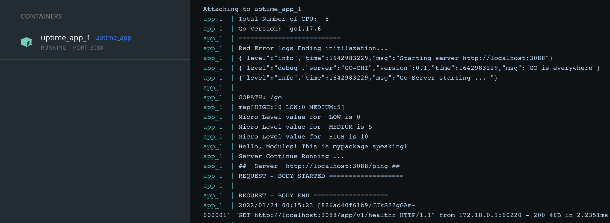

## Uptime Server

Simple API sever and web application using golang. The focus of this project is to build uptime check service for any given domain .
Also, this project helps to understand how diffrent Golang configure work using diffrent pakage.

## Command to start the Server with hot reload option

We are using nodemon npm module to run the server

```bash
nodemon --exec go run server.go --signal SIGTERM
```

**Server Endpoint**
http://localhost:3088/app/v1/healthz

## Local Build & Test Server

```bash
./run.sh
./out.go

```

## pre-commit-hooks

```bash
pre-commit install
git commit
```

**Golang commands**

```bash
go mod tidy

**Unit Testing**
go test ./... -v -cover -coverprofile=coverage.out

go tool cover -html=coverage.out

go test pkg/environmentvar/environmentvar.go pkg/environmentvar/environmentvar_test.go -v

**Docker Command**

This will “tag” the image uptime-server and build it. After it is built, we can run the image as a container.
docker build --tag uptime .
docker run --name uptime -p 3088:3088 uptime
docker run -d --name uptime-server -p 3088:3088 uptime-server
docker run -it -p 3088:3088 --rm --name uptime uptime
```

## goreleaser release

```bash
goreleaser release --snapshot --clean
goreleaser check
goreleaser build --single-target
export GITHUB_TOKEN="YOUR_GH_TOKEN"
git tag -a v0.1.0 -m "First release"
git push origin v0.1.0
goreleaser release --snapshot
goreleaser release


```

## Docker Compose build

We can use "docker-compose build" and "docker-compose up" commands, to build and run the application.


...
...
...
...
